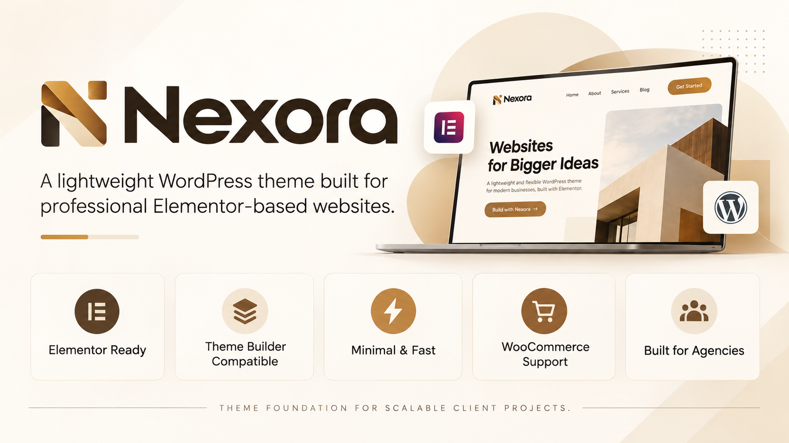

<p align="center">
  
</p>

<h1 align="center">Nexora</h1>

<p align="center">
  <strong>A lightweight WordPress foundation built for professional Elementor-based websites.</strong>
</p>

<p align="center">
  Built for studios, freelancers, developers, and teams that need a clean, scalable and highly customizable WordPress foundation.
</p>

---

## About Nexora

**Nexora** is a lightweight WordPress theme foundation designed primarily for websites built with **Elementor**.

Instead of competing with the page builder, Nexora provides the structural foundation that Elementor needs while keeping the frontend clean, minimal and fast.

The project is being designed for professional website production, especially environments where multiple client websites need to share a consistent, maintainable and reusable technical foundation.

Nexora aims to provide a complete ecosystem composed of:

- Nexora Theme
- Nexora Core
- Custom Content Types
- Custom Fields
- Relationships
- Dynamic Data
- Queries
- Dynamic Components
- Elementor integrations
- WooCommerce compatibility

The visual interface remains in the hands of Elementor.

Nexora handles the architecture behind it.

---

## Philosophy

Nexora follows a simple principle:

> **Let Elementor design the website. Let Nexora provide the foundation.**

The theme intentionally avoids unnecessary visual opinions, proprietary page builders and excessive frontend assets.

Instead, it focuses on:

- clean WordPress architecture;
- deep Elementor compatibility;
- reusable infrastructure;
- dynamic data;
- extensibility;
- performance;
- maintainability;
- professional client workflows.

---

## Elementor First

Elementor is the primary visual builder for Nexora.

The theme is designed to work naturally with Elementor and Elementor Pro without forcing additional theme styling into layouts.

Nexora is being built to support:

- Elementor Pages
- Elementor Containers
- Elementor Theme Builder
- Elementor Loop Builder
- Dynamic Tags
- Dynamic Content
- Header Templates
- Footer Templates
- Single Templates
- Archive Templates
- Search Templates
- 404 Templates
- WooCommerce Templates
- Custom Post Type Templates

When an Elementor Theme Builder template exists, Elementor controls the presentation.

When no Elementor template exists, Nexora provides a lightweight fallback.

---

## Theme Builder

Nexora supports Elementor Theme Locations so site structures can be visually designed without editing PHP templates.

The planned architecture supports:

```text
Header
Footer

Single
├── Posts
├── Pages
├── Products
└── Custom Post Types

Archive
├── Blog
├── Categories
├── Taxonomies
└── Custom Post Types

Search Results

404

Loop Items
```

This allows each project to have completely custom layouts while maintaining the same Nexora foundation.

---

## Minimal by Design

Nexora does not attempt to replace Elementor.

The theme intentionally avoids building redundant visual systems such as:

```text
Custom Page Builder
Custom Header Builder
Custom Footer Builder
Custom Layout Builder
Large Widget Libraries
Heavy CSS Frameworks
Visual Theme Options
```

Instead, Nexora provides a minimal presentation layer.

Elementor remains responsible for the website interface.

---

## Nexora Core

Nexora is planned as an ecosystem rather than a standalone theme.

The theme handles presentation.

The **Nexora Core** plugin will handle data and application functionality.

```text
WordPress
│
├── Nexora Theme
│
├── Nexora Core
│
├── Elementor
│
├── Elementor Pro
│
└── WooCommerce
    └── Optional
```

Keeping application functionality outside the theme ensures website data remains independent from the active WordPress theme.

---

## Custom Content Types

Nexora Core will include its own Content Type Manager.

This will allow administrators to create Custom Post Types without external plugins.

Example:

```text
Nexora
→ Content Types
→ Add New
```

A Content Type may define:

```text
Singular Name
Plural Name
Post Type Key
Slug
Icon
Public Visibility
Archive Support
REST API Support
Elementor Support
Search Support
```

Examples include:

```text
Services
Products
Projects
Clients
Team Members
Doctors
Properties
Courses
Locations
Testimonials
```

No CPT management plugin will be required.

---

## Custom Taxonomies

Custom taxonomies will also be managed directly through Nexora Core.

Example:

```text
Projects
└── Project Types

Services
└── Service Categories
```

Taxonomies may be hierarchical or non-hierarchical and may be connected to one or multiple Content Types.

---

## Nexora Fields

Nexora Core will include its own custom field system.

The goal is to provide structured WordPress data without depending on external field management plugins.

Planned field types include:

```text
Text
Textarea
Number
Email
URL
Phone

Select
Checkbox
Radio
True / False

Date
Time
Date & Time

Image
Gallery
File

Color

Taxonomy
Post
Relationship
User

Group
Repeater

WYSIWYG
```

Fields will be stored using WordPress-compatible data structures whenever appropriate.

---

## Field Groups

Fields can be organized into reusable groups.

Example:

```text
Project Information

├── Client
├── Project URL
├── Delivery Date
├── Technologies
├── Gallery
└── Featured Project
```

Field Groups can use display conditions such as:

```text
Post Type = Project
```

or more advanced rules in future versions.

---

## Global Fields

Nexora will also support global website information.

Examples:

```text
Company
├── Name
├── Logo
├── Registration Number
└── Description

Contact
├── Phone
├── WhatsApp
├── Email
└── Address

Social Networks
├── Instagram
├── Facebook
├── LinkedIn
├── YouTube
└── TikTok
```

These values will be accessible through Elementor Dynamic Tags.

---

## Relationships

Relationships are one of the core features planned for Nexora.

Content should be able to relate to other content without requiring custom PHP for every project.

Example:

```text
Service
    ↕
Products
```

Supported relationship models are planned to include:

```text
One to One
One to Many
Many to One
Many to Many
```

Relationships may also be:

```text
Bidirectional
Unidirectional
```

Example:

```text
Service
├── Product A
├── Product B
└── Product C
```

The reverse relationship can automatically expose:

```text
Product A
├── Service A
├── Service B
└── Service C
```

---

## Relationship Metadata

Nexora is also being designed to support data belonging to the relationship itself.

Example:

```text
Doctor
↕
Clinic
```

Relationship data could contain:

```text
Role
Schedule
Start Date
Priority
Featured
```

This makes relationships significantly more powerful than storing simple post IDs inside custom fields.

---

## Elementor Relationship Queries

Relationships will integrate directly with Elementor.

A future Elementor Loop Grid could use:

```text
Query Source
→ Nexora Relationship
```

Example:

```text
Current Service
        ↓
Related Products
        ↓
Elementor Loop Grid
```

This removes the need for custom PHP queries in common relationship scenarios.

---

## Dynamic Tags

Nexora will register its own Elementor Dynamic Tags.

Planned sources include:

```text
Nexora Field
Nexora Global Field

Related Field
Related Image
Related URL
Related Post Title
Related Post URL

Relationship Field
Relationship Count

Query Result
```

The objective is simple:

> Data configured through Nexora should be usable visually inside Elementor.

---

## Dynamic Components

Nexora is planned to include a reusable component system integrated with Elementor.

Instead of developing a new Elementor widget every time a structured component is needed, administrators will be able to define components using fields.

Example:

```text
Component
Feature Card

Fields
├── Eyebrow
├── Icon
├── Title
├── Description
├── Button Label
└── Button URL
```

The component can then become available through an Elementor Dynamic Component widget.

Another example:

```text
Testimonial Card

├── Photo
├── Name
├── Company
├── Testimonial
└── Rating
```

Components may accept both manual and dynamic values.

---

## Query Engine

Nexora will provide a reusable query layer.

Queries may combine:

```text
Content Type
Custom Fields
Taxonomies
Relationships
Dates
Search
Ordering
Pagination
```

Example:

```text
Query
Featured Products for Current Service

Post Type:
Product

Relationship:
service_products

Related To:
Current Post

Field:
featured = true

Order:
menu_order

Limit:
8
```

The goal is to make these queries available directly to Elementor.

---

## WooCommerce

WooCommerce support is part of the Nexora architecture.

The theme provides compatibility for:

```text
Product Galleries
Product Archives
Single Products
Cart
Checkout
WooCommerce Elementor Templates
```

WooCommerce remains optional and is only loaded when needed by a project.

---

## Performance

Nexora follows a performance-first approach.

The theme aims to avoid:

```text
Large frontend frameworks
Unnecessary JavaScript
Global widget libraries
Heavy CSS resets
Theme-specific visual overrides
Excessive dependencies
```

Assets should only exist when they provide real functionality.

---

## Brand Palette

The default Nexora identity uses a warm ochre-inspired color system.

| Color | Hex |
| --- | --- |
| Deep Espresso | `#2B2218` |
| Burnt Umber | `#6A4B2A` |
| Rich Ochre | `#B67A2D` |
| Golden Ochre | `#D29A3A` |
| Sand Beige | `#E9D2A6` |
| Warm Ivory | `#F8F2E8` |

These colors represent the Nexora brand and may also be available as default WordPress design tokens.

They do not restrict client website palettes.

---

## Architecture

The planned platform architecture is:

```text
Nexora
│
├── Theme
│   ├── WordPress Templates
│   ├── Elementor Theme Locations
│   ├── Lightweight Fallbacks
│   ├── WooCommerce Compatibility
│   └── Minimal Frontend Assets
│
└── Core
    │
    ├── Content Types
    ├── Taxonomies
    ├── Fields
    ├── Field Groups
    ├── Global Fields
    │
    ├── Relationships
    │   ├── Relationship Builder
    │   ├── Reverse Relationships
    │   └── Relationship Metadata
    │
    ├── Queries
    │
    ├── Components
    │
    └── Elementor
        ├── Dynamic Tags
        ├── Dynamic Components
        ├── Relationship Queries
        └── Query Integration
```

---

## Project Principles

Nexora development follows several core rules.

### Elementor should remain in control of design

The theme should never introduce styling that makes Elementor layouts difficult to control.

### Data belongs outside the theme

Content Types, Fields and Relationships belong to Nexora Core.

### No unnecessary dependencies

Native WordPress APIs should be preferred whenever practical.

### Configuration should replace repetitive coding

Features commonly repeated between client websites should become reusable Nexora functionality.

### Dynamic data should be visually accessible

Whenever possible, data created in Nexora should be usable from Elementor without writing PHP.

### Professional projects should remain maintainable

Nexora should make websites easier to maintain, migrate and extend over time.

---

## Development Status

Nexora is currently under active development.

Current focus:

```text
[✓] Project architecture
[✓] Brand identity
[✓] Elementor-first strategy
[✓] Theme structure
[ ] Theme implementation
[ ] Nexora Core bootstrap
[ ] Content Type Manager
[ ] Taxonomy Manager
[ ] Fields Engine
[ ] Relationship Engine
[ ] Elementor Dynamic Tags
[ ] Elementor Relationship Queries
[ ] Dynamic Components
[ ] Query Builder
[ ] Global Fields
[ ] Import / Export
```

---

## Roadmap

### Phase 1 — Theme Foundation

```text
Theme Bootstrap
WordPress Support
Elementor Compatibility
Theme Locations
Template Fallbacks
theme.json
Asset Management
WooCommerce Compatibility
```

### Phase 2 — Content Architecture

```text
Nexora Core
Content Type Manager
Taxonomy Manager
Admin Interface
Configuration Storage
```

### Phase 3 — Fields

```text
Field Groups
Field Types
Conditional Display
Global Fields
Elementor Dynamic Tags
```

### Phase 4 — Relationships

```text
Relationship Builder
Relationship Database
Bidirectional Relationships
Reverse Queries
Relationship Metadata
Elementor Integration
```

### Phase 5 — Dynamic Elementor

```text
Dynamic Tags
Relationship Queries
Query Engine
Dynamic Components
Loop Integration
```

### Phase 6 — Platform Tools

```text
Import / Export
Configuration Packages
Developer APIs
Project Presets
Update System
Diagnostics
```

---

## Repository

This repository currently acts as the public presentation and documentation page for the Nexora project.

The active source code may be maintained separately while the architecture is being developed and stabilized.

---

## Requirements

Planned environment:

```text
WordPress 6.8+
PHP 8.1+
Elementor
Elementor Pro recommended
WooCommerce optional
```

Compatibility targets may change as development progresses.

---

## License

Licensing information will be defined before the first public source release.

---

<p align="center">
  <strong>Nexora</strong><br>
  Theme foundation for scalable client projects.
</p>